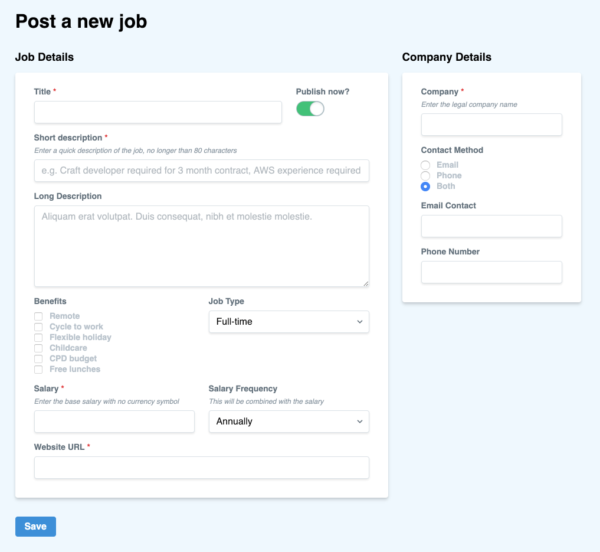

# FFFields

Fabulous front-end fields for Craft to help you create front-end forms and dashboards.


---

**Note:** The license fee for this plugin is $59 via the [Craft Plugin Store](https://plugins.craftcms.com/fffields).


## Requirements

This plugin requires Craft CMS 3.1.0 or later.


## Installation

To install the plugin, follow these instructions.

1. Open your terminal and go to your Craft project:

        cd /path/to/project

2. Then tell Composer to load the plugin:

        composer require angellco/fffields

3. In the Control Panel, go to Settings → Plugins and click the “Install” button for FFFields.


You can also install FFFields via the Plugin Store in your Craft control panel, look for the “Plugin store” link in the main navigation and then search “FFFields”.


## FFFields Overview

FFFields gives you a complete toolkit to create fabulous front-end forms and dashboards. You can hook up your fields to Craft via the [CraftQL plugin](https://plugins.craftcms.com/craftql) or roll your own solution.

This plugin makes use of [Vue.js](https://vuejs.org/) and [Tailwind CSS](https://tailwindcss.com), but you don’t need to know either to use it.

Here is an example form that allows users to submit job postings:



FFFields uses the fields you have already defined in Craft and handles the validation requirements you have set too.

### Currently supported field types

- Plain Text
- URL
- Email
- Lightswitch
- Number
- Dropdown
- Radio Buttons
- Multi Select
- Checkboxes


## Configuring FFFields

There is no configuration to get FFFields working on its own, but if you want to tie in with CraftQL then you need to do a few extra things.

1. Install the CraftQL plugin and setup up your endpoint and a token in the settings page.

2. Next, add the following environment variables to your `.env` file:

        FFF_GQL_ENDPOINT="https://my-craft-site.com/api"
        FFF_GQL_TOKEN="<token-from-craftql>"

3. And finally, make sure to wrap your fields in the `{{ craft.fffields.formStart() }}` and `{{ craft.fffields.formEnd() }}` tags as detailed in the usage section. 


## Using FFFields

To get started, output the following tag near the bottom of your page:

```twig
{{ craft.fffields.includeAssets() }}
``` 

This will include the various CSS and JS that is needed to run things.

If you don’t want to include the CSS, perhaps because you want to make your own Tailwind theme, then you can pass in `false` like so:

```twig
{{ craft.fffields.includeAssets(false) }}
```

### Rendering fields

To render a field use the following method:

```twig
{{ craft.fffields.renderField('fieldHandle') }}
``` 

This method accepts a bunch of parameters as follows:

```twig
{{ craft.fffields.renderField(handle, value = null, required = false) }}
```

1. `handle`: this is required and should be a string
2. `value`: optional, defaults to `null`
3. `required`: optional, defaults to `false`


There is also another similar method for outputting special fields such as the `title`:

```twig
{{ craft.fffields.renderSpecial(handle, value = null, required = false) }}
```

The `handle` for this method should be one of the following supported list:

- `title` - renders a standard Element Title field
 


### Wrapping in a form

If you plan on using CraftQL to handle the form submissions then you can wrap your fields in the following two tags:

```twig
{{ craft.fffields.formStart(mutation, enabled = true, redirect = null, elementId = null) }}

  {{ craft.fffields.renderField() }}
  ...

{{ craft.fffields.formEnd() }}
```

The attributes for the `formStart()` method can be configured as follows:

1. `mutation`: required. Set this to the GraphQL mutation you want to use, e.g. `upsertJobs`.
2. `enabled`: optional, defaults to `true`. Set this to false if you want to submit a disabled element.
3. `redirect`: optional, defualts to `null`. Set this to the path you want the user to be redirected to after a successful submission. Token substituion is supported so `/jobs/edit/{id}` would replace `{id}` with the ID value that is returned after submission. Currently supported tokens are `{id}`, `{slug}` and `{url}`.
4. `elementId`: optional, defualts to `null`. Set this to the ID of the element you want to edit.


## FFFields Roadmap

### General

- [x] Release it
- [ ] Firm up the Vue Form API and document it
- [ ] Allow class overriding in Twig and Vue
- [ ] Build out the Vue-only API that fetches field config over XHR
- [ ] Add the ability generate full views from entry types


### Special attributes

- [ ] Enabled / disabled
- [ ] Slug
- [ ] Post Date
- [ ] Expiry Date
- [ ] Author
- [ ] Parent
- [ ] All User attributes

### Field types

- [ ] Matrix
- [ ] Date/Time
- [ ] Table
- [ ] Tags
- [ ] Entries
- [ ] Categories
- [ ] Users
- [ ] Assets
- [ ] Color
- [ ] Redactor

### Support specific forms

These will need testing once the various special attributes for each form are added and then a full example for each can be documented.

- [ ] Login
- [ ] User Profile
- [ ] User Registration
- [ ] Forgot Password
- [ ] Set Password


Brought to you by [Angell & Co](https://angell.io)
